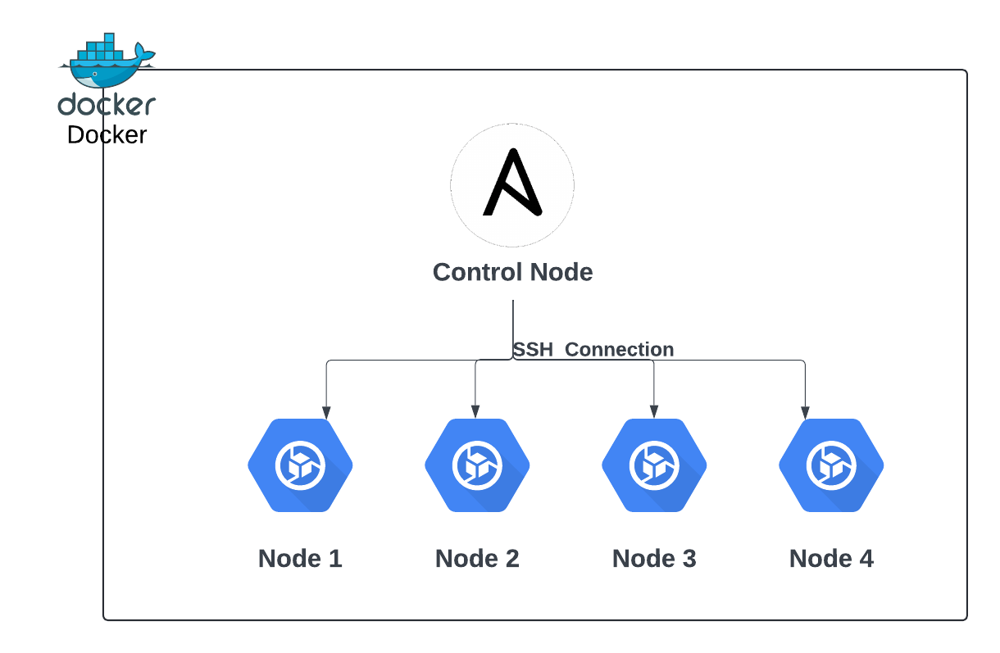

# Using Ansible to connect to a list of containers

This project is a experiment where it's launched 5 docker containers. Four of them are managed nodes and the other one is a control node with ansible installed. With this architecture, the control node is able to run commands in all nodes and manage them. 



## Usage

Build and run the container: `docker compose up -d --build`

Enter in the control node and execute the plybook in all managed nodes: 
```
# Enter in the control-node
$ docker exec -ti control-node sh
# Inside the container tell ansible to execute playbook in all nodes
$ ansible-playbook -kK playbook.yaml
```

The playbook is a descriptive file located in `control-node/playbook.yaml`. It's example of how the playbook files looks like, this playbook installs git and clone this repository in all nodes. After it, the playbook run a script in all nodes.

## TO-DO

- Avoid password authentication.
